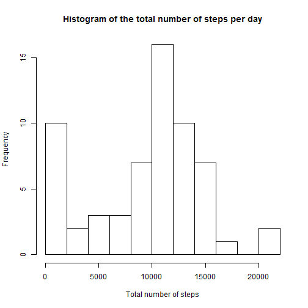
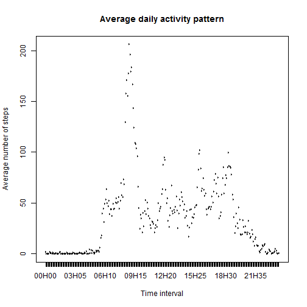
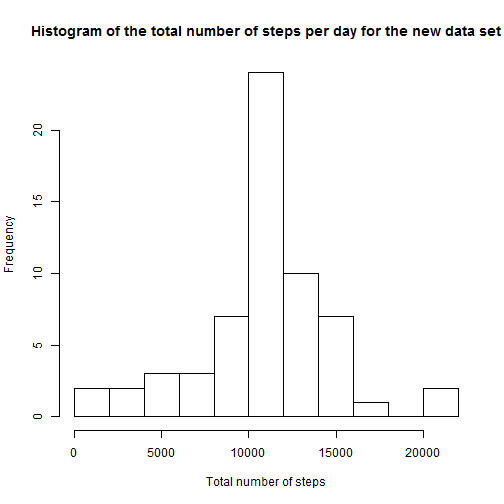
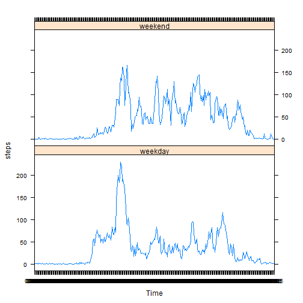

## Loading and preprocessing the data

Note : the following markdown file assumes that it is run in the same directory as where the zipped data file ***activity.zip*** is located.

The following code allows to read the zip file containing the data and store it to a ***dat***  variable. It will also allow us to see the first 6 lines of the dataset:


```r
## Defining the columns' classes : 
cls <- c("integer", "Date", "integer")

## Reading the data set : 
dat <- read.csv(unzip("activity.zip"), colC=cls)

## Transforming the time column
hrs <- rep(rep(0:23, each=12),61)
min <- rep(seq(0,55,by=5),1464)

hrs <- formatC(hrs, width=2, flag="0")
min <- formatC(min, width=2, flag="0")
dat$interval <- paste(hrs,min, sep="H")

## Preview of the fist lines : 
head(dat)
```

```
##   steps       date interval
## 1    NA 2012-10-01    00H00
## 2    NA 2012-10-01    00H05
## 3    NA 2012-10-01    00H10
## 4    NA 2012-10-01    00H15
## 5    NA 2012-10-01    00H20
## 6    NA 2012-10-01    00H25
```
Defining the classes of the columns allows for R to directly coerce the data of the 'date' column into a ***Date*** format.
At this stage, the data table is "tidy", with missing values recognised as such and with relevant column classes. We could have transformed the  **date**  column further to account for the time interval but leaving the  **interval**  column as a character string makes the analysis easier.

## What is mean total number of steps taken per day?

Let's calculate the number steps taken each day :

```r
## Calculating the total number of steps per day : 
step.day<-tapply(dat$steps,dat$date,sum,na.rm=T)

## Getting the number of days, defining the labels and titles :
xlab  <- "Total number of steps"
main  <- "Histogram of the total number of steps per day"

## Plotting the histogram of the number of steps per day : 
hist(step.day, xlab = xlab, main = main, breaks = 10)
```

 

The **step.day** variable contains the total number of steps taken each day.

Calculating the mean and the median of the number of steps per day :

```r
mn <- round(mean(step.day),0)
md <- round((quantile(step.day, probs = .5)),0)
```
Thus, the average steps per day is 9354 (rounded to the nearest integer) and the median number of steps per day is 1.0395 &times; 10<sup>4</sup>.

Note : taking the average of  **dat$steps**  would have given us the average number of steps per 5 minutes interval per day.


## What is the average daily activity pattern?

Let's calculate the average steps taken per 5 minutes interval :


```r
## Compute the mean number of steps for each time interval
steps.int <- tapply(dat$steps,dat$interval,mean,na.rm=T)

## Plot the time series
xlab <- "Time interval"
ylab <- "Average number of steps"
main <- "Average daily activity pattern"
x <- factor(dat$interval[1:288])
plot(x, steps.int, type="l", xlab = xlab, ylab = ylab, main = main)
```

 

```r
## Find the maximum average number of steps per time interval
mx <- round(max(steps.int),2)
indice <- steps.int == max(steps.int)
indice  <- which(indice)
max.int1 <- dat$interval[indice]
max.int2 <- dat$interval[indice+1]
```

Thus, the maximum average steps taken per 5 minutes is 206.17 (rounded to the hundredth) and is reached between 08H35 and 08H40.

## Imputing missing values

Let us compute the number of missing values :


```r
missing.sum <- sum(is.na(dat$steps))
```

Thus, there are 2304 missing values in our data set. Since we have seen that the number of steps taken is strongly correlated to the time interval, let's fill in the blanks with the average number of steps taken for that interval. Now, let's build the completed data set:


```r
missing <- is.na(dat$steps)
miss <- which(missing)
dat2 <- dat

for (i in miss) {
    int <- dat2$interval[i]
    indice <- dat$interval[1:288] == int
    indice <- which(indice)
    dat2$steps[i] <- steps.int[indice]
}
```

Let's compute the new numbers of steps taken each day :


```r
## Calculating the total number of steps per day : 
step.day2<-tapply(dat2$steps,dat2$date,sum)

## Getting the number of days, defining the labels and titles :
xlab  <- "Total number of steps"
main  <- "Histogram of the total number of steps per day for the new data set"

## Plotting the histogram of the number of steps per day : 
hist(step.day2, xlab = xlab, main = main, breaks = 10)
```

 

Calculating the new mean and median of the number of steps per day :

```r
mn2 <- round(mean(step.day2),0)
md2 <- round((quantile(step.day2, probs = .5)),0)
```
Thus, the average steps per day is 1.0766 &times; 10<sup>4</sup> (compared to 9354) (rounded to the nearest integer) and the median number of steps per day is 1.0766 &times; 10<sup>4</sup> (compared to 1.0395 &times; 10<sup>4</sup>).

The median has remained approximately the same, while the maen has increased. This is sensible since the total number of days has remained the same while the total steps taken have increased (8 days were missing and therefore had a total number of steps taken equal to 0)

We can also highlight that the median and the mean are the same. That is a consequence of the distribution having become centered. In fact we just replaced the data for the 8 missing days by the average daily activity paatern. Let's see how much activity this pattern represents :


```r
sum.steps <- round(sum(steps.int),0)
```

Thus, we simply added 8 days for which the total number of steps went from 0 to 1.0766 &times; 10<sup>4</sup>. That shifted mass from the 0 - 2,000 class (far left of the histogram) to the 10,000 - 12,000 class (center).

## Are there differences in activity patterns between weekdays and weekends?

Let's create the factor vector for weekdays and weekends.

Note : my system runs in french, abbreviated weekdays are :
* Mon. = lun.
* Tue. = mar.
* Wed. = mer.
* Thu. = jeu.
* Fri. = ven.
* Sat. = sam.
* Sun. = dim.


```r
library(lattice)

wdys <- weekdays(dat$date, abbr = TRUE)
wend1 <- wdys == "sam."
wend2 <- wdys == "dim."
wend <- wend1 | wend2

dat.weekdays <- dat2[!wend,]
y1 <- tapply(dat.weekdays$steps,dat.weekdays$interval,mean)
dat.weekends <- dat2[wend,]
y2 <- tapply(dat.weekends$steps,dat.weekends$interval,mean)
y <- c(y1,y2)

x <- dat$interval[1:288]
x <- c(x,x)

factors <- factor(c(rep("weekday", 288), rep("weekend", 288)))

df <- data.frame("steps" = y, "Time" = x, "dayType" = factors)

## Plot
xyplot(steps ~ Time |dayType, data = df, layout = c(1, 2), type = "l")
```

 
